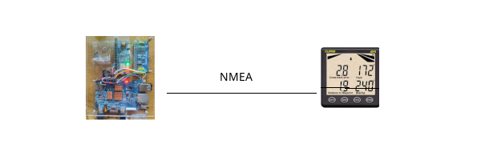
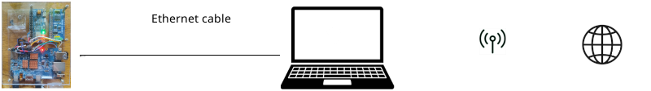

= OpenCPN on an Orange Pi 5
:toc: left

This is a small, personal project where I run OpenCPN on an Orange Pi 5
(OrPi5) SBC.
This SBC is similar to Raspberry Pie 5, but is more powerful, needs
less current and is somewhat more expensive.

The overall goal is configure the system to run continously without the 
power consumption of a PC and/or a big screen.
The system uses as of now about 200mA at 12V.

== Use cases:

=== Planning

One or more route(s) are created using the PC, transferred to the SBC
over wifi and activated.

=== Sailing

The SBC keeps track of data such as bearing and distance to waypoint which
is displayed on a NMEA repeater.
Not requiring a PC means that this runs in a small power envelope.

=== Plotting

At any point the PC lid can be opened and the current position on chart and
active route is displayed.
A tablet is also practical for plotting.

image::plotting.png[]

=== Maintenance

The SBC is connected to the internet using the PC as router to make it
possible to update charts, software, etc.

== Hardware.

The original Orange Pi 5 version is used. 
This has an NVME connector which makes is possible to use an NVME disk
which faster and more reliable than the otherwise used SD cards.
The downside is that there is no wifi connection, this must be done
using a separate USB wifi module

There is also two separate cards for GNSS positioning and canbus/RS485
IO. The latter is not used for the moment.

Besides the SBC a PC is used for planning and plotting. I run Fedora Linux
on this PC.
It should be possible to use a windows PC instead, but the network setup
might perhaps be challenging.

== Software

The operating system is Debian Linux.

The support for the RK3588 SOC is yet not upstreamed to the kernel.
As a consequence one need to use the orangepi 5 repositories. 
This is mainly to get access to the modified kernel required, but there
are also some user space tools provided.
Orangepi has an extensive manual covering OS installation.

As for OpenCPN, version 5.10 is required.
This has some important fixes for headless usage. 
Since we use the orangepi repositories, the easiest is to use the Flatpak
version.

== Details

=== Hardware

  - http://www.orangepi.org/html/hardWare/computerAndMicrocontrollers/details/Orange-Pi-5.html[Orange Pi 5]
    I have chosen the original version with an NVME port so I can add an
    SSD disk.
    The wifi then needs to be connected using USB.

  - A waveshare L76X Multi-GNSS hat handling the GPS, 
    https://www.waveshare.com/l76x-gps-hat.htm.
    It comes with an antenna which works for indoor testing, but
    for my yacht I use a 
    https://www.amazon.com/Garmin-GA-GPS-GLONASS-Antenna/dp/B072Q4C5LM/ref=sr_1_30[Garmin GPS antenna]
    mounted on the pushpit.
    The card also needs a battery.

  - A TP-Link Archer T3U Plus USB wifi module,
    https://www.amazon.se/dp/B0859M539M.
    Could be anything as long as its supported by the 6.1 kernel.

  - 4A power USB-C Power supplys, 220V for testing, 12V for yacht
    connection.

  - A bootstrap sd card, nothing fancy.  32GB is enough.

  - An short nvme SSD, I used https://www.amazon.se/dp/B0BTDPXWPC

  - 40-pin raspberry connectors for soldering, female (for OrPi5) and
    male (for waveshare GPS card) like
    https://www.aliexpress.com/item/1005002833659269.html

=== Starting OpenCPN

OpenCPN is started when system is booted.
This is done by dropping an _opencpn.desktop_ file in _~/.config/autostart/_
An example desktop file can be found here.

=== Stopping OpenCPN

The SBC is stopped by pushing a hardware button.
Pushing this button starts the _opencpn-stop_ script. 
When this is completed the system is brought down using `shutdown`. 

Bits and pieces:

*  _power-btn.service_: A systemd service tracking the power off button.
*  _power-btn_: Script used by the systemd service
*  _opencpn-stop_: python script basically performing
  `opencpn --remote --quit`, but "better" -- see comments in script.
